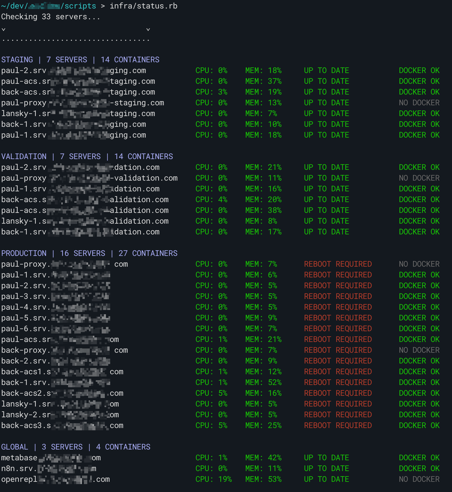

# Docker Servers Status Script

Will connect to all your servers (in parallel) and report:

- CPU and memory usage
- If updates are available and if a reboot is required
- Running Docker containers against a given list, noting missing and extras



## Setup

You will need Ruby >3. I don't think you need any gems.

You need _mpstat_ on your servers. It's part of the default Ubuntu install but not the AWS version. If you see "CPU: ???", run: `sudo apt install sysstat`

### config.yml

Root keys are groups with arrays of servers.

For each server:

- `name` : the hostname of the server
- `containers` : a list of containers expected to run. Matched as start of running containers. E.g. `myapp-staging` will match running container `myapp-staging-latest-123abc`.
- `proxy` : whether to expect `kamal-proxy`. Defaults to true
- `docker` : whether to expect Docker running at all. Defaults to true
- `user` : SSH user. Defaults to `root`
- `identity_file` : path to SSH key

Example:

```yaml
staging:
  - name: api.staging.myapp.com
    containers:
      - myapp-staging
  - name: db.staging.myapp.com
    containers:
      - myapp-postgres-staging
    proxy: false
  - name: barebone.myapp.com
    docker: false
    user: ubuntu
    identity_file: ~/keys/barebone.pem
production:
# ...
```

## Usage

`./status.rb`
